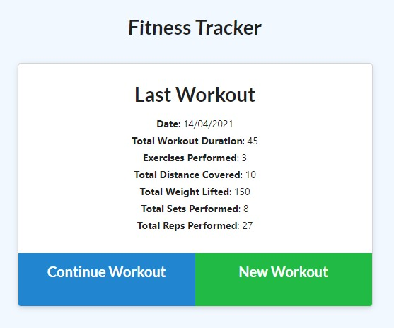
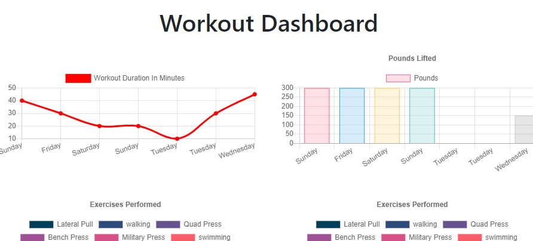

# Workout Tracker

## Description
The aim of this project is to create an application where users can track their workouts each day and view the statistics of their workouts over the past seven days using a nosql database called mongodb. 

## Table of Contents 

* [Installation](#installation)
* [Usage](#usage)
* [License](#License)
* [Contributing](#contributing)
* [Test](#test)
* [Questions](#questions)

## Installation
The technologies used for this project include JavaScript, Node.js, mongoose, express, mongodb, html and css. To install this project, please ensure you have donwloaded Node.js, install all the dependencies and start the application using the command "npm start". 

## Usage
Screenshots of how the application looks are provided below.

## License 
Permission is hereby granted, free of charge, to any person obtaining a copy of this software and associated documentation files(the "Software"), to deal in the Software without restriction, including without limitation the rights to use, copy, modify, merge, publish, distribute, sublicense, and / or sell copies of the Software, and to permit persons to whom the Software is furnished to do so, subject to the following conditions: The above copyright notice and this permission notice shall be included in all copies or substantial portions of the Software. THE SOFTWARE IS PROVIDED "AS IS", WITHOUT WARRANTY OF ANY KIND, EXPRESS OR IMPLIED, INCLUDING BUT NOT LIMITED TO THE WARRANTIES OF MERCHANTABILITY, FITNESS FOR A PARTICULAR PURPOSE AND NONINFRINGEMENT.IN NO EVENT SHALL THE AUTHORS OR COPYRIGHT HOLDERS BE LIABLE FOR ANY CLAIM, DAMAGES OR OTHER LIABILITY, WHETHER IN AN ACTION OF CONTRACT, TORT OR OTHERWISE, ARISING FROM, OUT OF OR IN CONNECTION WITH THE SOFTWARE OR THE USE OR OTHER DEALINGS IN THE SOFTWARE.

## Contributing
Anyone is welcome to contribute to this project as per the license guidlines.

## Test
No tests are currently available for this project.

## Questions
If you have any questions or would like further information on this project, 
please contact silviataliana2@gmail.com or find me on [Github](https://github.com/silvia-taliana).
